# Índice

- [O que é AEDS](#Algoritmo-e-Estrutura-de-Dados)
- [Paradigmas de Programação](#Paradigmas-de-Programação)
	- [Programação Estruturada](##Programação-estruturada)
	- [Linguagem C](##Linguagem-C)
		- [Bibliotecas](###Bibliotecas)
		- [Expressões](###Expressões-em-C)
- [Função](#Função)
- [Tipos de Dados](#Tipos-de-dados)
- [Variáveis](#Variáveis)
	- [Modificadores e especificadores](##Modificadores-e-especificadores)
		- [Especificadores de tipo de classe de armazenamento](###Especificadores-de-tipo-de-classe-de-armazenamento)
		- [Modificadores de tipo de acesso](###Modificadores-de-tipos-de-acesso)
- [Operadores](#Operadores)
- [Comandos de controle](#Comandos-de-controle-do-programa)
	- [Comandos de Seleção](##Comandos-de-seleção)
	- [Comandos de Iteração](##Comandos-de-Iteração)
- [Matrizes e vetores](#Matrizes-e-vetores)
- [Ponteiros](#Ponteiros)
- [Struct](#Struct)
- [Recursividade](#Recursividade)
- [Alocação de memória](#Alocação-de-memória)
	- [Alicação Dinâmica de memória](##Alocação-dinâmica-de-memória)

# Algoritmo e Estrutura de Dados
## O que é?
É o estudo de algoritmos e estruturas de dados.

## Para que serve?
O algoritmo serve para, a partir de uma entrada, termos uma saída.

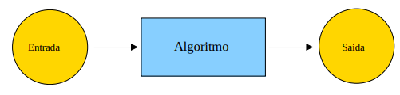

## Como funciona?
De forma similar a uma receita que informa o que deve ser feito. Todavia, usa-se uma linguagem de programação. Algumas delas são:
- C;
- C++;
- Python;
- Java;
- Pascal;
- Fortran.

Todas elas tem seus paradigmas e regras específicas. E seguem a seguinte linha de raciocínio:

Código (Linguagens de programação) `->` Compilador ou Interpretador`->` Programa (Binário)

- Qual a diferença entre um compilador e um interpretador?

|  Compilador | Interpretador |
|---|-------|
| Lê o programa todo e converte-o em código-objeto  | Lê o programa linha por linha e executa |
| O tempo de compilação é gasto só uma vez  | O código fonte do programa deve existir sempre durante a execução |

# Paradigmas de Programação

## O que é?
Segundo o [Wikpédia](https://pt.wikipedia.org/wiki/Paradigma_de_programa%C3%A7%C3%A3o), "Paradigma de programação é um meio de se classificar as linguagens de programação baseado em suas funcionalidades"
## Para que serve?
Para que o programador tenha uma visão da estruturação e execução do programa

## Como funciona?
Existem vários paradigmas. Todavia, iremos abordar principalmente estes:
1. **Programação estruturada**
2. **Programação estruturada em blocos**
3. **Programação Orientada a Objetos**


Ambos têm a mesma função, resolver problemas. Porém, as formas de se analisar e simular o problema, são diferentes. Na Disciplina de **AEDS I**, focaremos na programação estruturada. Todavia, saiba que existem outros paradigmas.

## Programação estruturada

### Como funciona?
É uma programação baseada em laços de repetição, condicionais e estruturas em bloco (**Funções**). Formada por uma **sequência** de instruções e a comunicação entre os blocos se dá pela passagem de dados;

Mas, qual a diferença entre programação estruturada e programação estruturada em blocos? A programação estruturada em blocos permite criação de funções dentro de outras funções, diferentemente da estruturada, que permite loops.

### Abordagens práticas
Usaremos para as explicações, a linguagem de programação C.

## Linguagem C
- Linguagem de alto nível;
- Baseada em funções;
- Case sensistive (letras maiúsculas e minúsculas têm diferenças);
- Portátil
  -  Significa que um mesmo software escrito em C para um tipo de computador, geralmente, serve para outros tipos;
- Compilada, ou seja, o computador não consegue interpretar o código diretamente:
  - Depois que o código é escrito, o compilador "memoriza" os nomes das funções que ele usa e, posteriormente o linkeditor combina o código-objeto com o código que você já escreveu.
  - Não vou entrar em detalhes nesse resumo mas o compilador, normalmente usa 4 áreas na memória:
    - 1ª área: Contém o código;
    - 2ª área: Contém variáveis globais;
    - 3ª área ou Pilha : endereço de retorno das chamadas de função, argumentos e variáveis locais (dinâmica e mutável);
    - 4ª área ou Heap : região de memória livre que o programa pode usar (funções de alocação dinâmica) 
```
Código fonte (Source) --- compilador (GCC)---> código-objeto --- Montagem ---> código binário
```


### Bibliotecas
#### O que é?
Funções externas à linguagem.

#### Para que serve?
Uma vez que a linguagem C é uma linguagem com poucos comandos (por exemplo, não contém nenhum método de executar operações de entrada e saída), faz-se necessário o uso de funções exeternas contidas nas bibliotecas. A fim de gerar a portabilidade da linguagem C, em 1983 surgiu o padrão C ANSI responsável por definir padrões.  O padrão C ANSI especifica um conjunto mínimo de funções que fazem parte *biblioteca C padrão* que é contida nos compiladores;

### Como funciona?
Bibliotecas são definidços no início do programa e referenciam arquivos de cabeçalho '.h'. Usando a diretiva **#include**, você informa ao pré-processador a inclusão de um módulo e usando o indicador **<>** você informa que o arquivo de cabeçalho será fornecido pelo compilador.

Exemplos de inclusão de bibliotecas:
```
/*
* Esse código mostra no console o texto "Olá mundo!".
*/
#include <stdio.h> /* inclui o arquivo de cabeçalho da biblioteca stdio*/ 

/* Você não precisa entender essa função no momento. */

void main(void){
  printf("Olá mundo!");
}
```

Obs.: Os elementos "/**/" apresentam comentários. Comentário são textos nos códigos que o compilador não ignora e são usados para explicar determinadas funcionalidades a fim de que outras pessoas possam entender o seu código. 

### Expressões em C
Uma expressão em C é qualquer combinação válida que envolve variáveis, constantes, tipos de dados e operadores.

Exemplos de expressões:
1. **x = f1() + f2()**
   1. Cuidado, o padrão C ANSI não estipula que as subexpressões devam ser avaliadas em uma ordem especificada. Assim, essa declaração não garante que f1() será chamado antes.
2. **<variável> += 10**
   1. Mesma coisa que:  **<variável> = <variável> + 10**
   2. Chamamos o ponto 2 de C reduzido.

# Função

## O que é?
É uma sub-rotina isolada usada em um programa. Um bloco (definido por '{}') de comandos relacionados logicamente a fim de realizar alguma tarefa do programa.

## Para que serve?
Para facilitar, modular e compartimentalizar o programa:
- Tarefas diferentes são executadas em funções diferentes;
- Informações específicas necessárias para realização de uma tarefa específica em uma função são escondidas do restante do programa.

## Como funciona?
A função mais importante em C é a função **main()**, ela é a responsável por descrever um caminho principal e, nela, surgem chamadas para outras funções que executarão tarefas específicas. Ou seja, é o ponto inicial que define o escopo do seu programa. Definição de funções em C: 

```
#include <stdio.h> /*Introdução dos arquivos de cabeçalho da biblioteca stdio*/

void nome_func(void); /*Declaração de uma função 'nome_func'*/


void main(void)
{
  nome_func();
}

void nome_func(void)
{
  /*Definindo o escopo da função 'nome_func'*/
  printf("Olá Mundo!");
}
```

# Tipos de dados
## O que é?
São os possíveis conjuntos que os dado dos programas pertencem. Os tipos de dados envolvem números ou characteres.

## Para que serve?
Classificação, validação e fiscalização (por parte do compilador) das expressões em C. Existem algumas linguagens que são fortemente typadas e outras, fracamente typadas. As fortemente typadas (que é o caso da linguagem C) exigem que o tipo do dado seja fornecido, algo que não acontece nas fracamente typadas.


## Como funciona?
Os tipos de dados básicos ou primitivos são:
```Markdown
> charactere (char):
  - characteres, letras, símbolos.;
> inteiro (int):
  - Dados com informações do conjunto dos inteiros.;
> ponto flutuante (float):
  - Dados com informação dos conjuntos reais de precisão simples;
> ponto flutuante de precisão dupla (double):
  - Dados com informação dos conjuntos reais com maior precisão;
> sem valor (void).
```

Além dos tipos básicos de dados existem **modificadores** que são prefixos que alteram os tipos primitivos de dados. Eles podem ser usados com duas finalidades:
- Indicar se o bit significativo representará sinal negativo ou não (baseando-se na notação compelemento-de-dois)
```Markdown
> Signed:
  - O bit mais significativo é usado para definir sinal.
> Unsigned:
  - Desconsidera valores negativos, ou seja o bit significativo não é usado para definir sinal.
```
- Indicar o tamanho (número de bits) usados para representar um valor
```Markdown
> Long:
  - Dobra o número de bits
> Short
```

Pensando nos modificadores que envolvem o bit significativo. Imagine o número binário do tipo int (2 bytes):
<center>
11111111 11111111

Em decimal (considerando o bit mais significativo): -32.767
</center>

Como o bit mais significativo (o primeiro) é 1, o número é negativo. Porém, se você o declarar como unsigned, o número se tornará 65.535. Você dobra a grandeza absoluta. 

O tamanho e a faixa desses tipos de dados na memória variam de acordo com o processador e implementação do compilador C. Existe uma função na linguagem C que mostra o número exato de bytes de uma variável e é dado por **sizeof** (pode auxiliar na portabilidade do código). O tamanho dos tipos são definidos no padrão ANSI da seguinte forma:

<center>

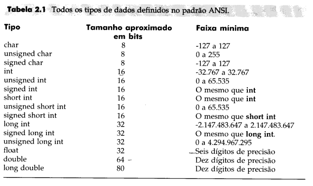
</center>

Mas, o que isso quer dizer? Imagine uma variável do tipo char. Entenda que se o espaço disponível para guardar variáveis do tipo char são 8 bits, temos 2⁸ = 256 combinações possíveis (0 a 255). Portanto, cada character nada mais é do que um número natural entre 0 e 255. Por curiosidade, a tabela ASCII usa apenas bytes cujo primeiro bit é 0 e portanto tem apenas 128 linhas. 

C suporta alguns diversos códigos de barra invertida (normalmente characteres impossíveis de inserir pelo teclado):

<center>

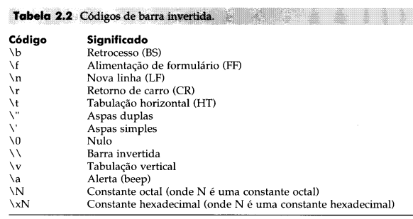
</center>

Como essas informações apresentadas são curiosidades, deixarei algumas perguntas.


Dúvidas que não serão respondidas:
1. Se só existem 128 characteres na tabela ASCII, para que serve o restante dos números que podem ser representados por 8 bits?
2. Usar unsigned e signed char faz algum sentido?  


# Variáveis

## O que é?
São espaços endereçados na memória (dividida em bytes e cada byte tem seu endereço) do computador capaz de reter e representar um valor ou expressão.
 
## Para que serve?
Representar um valor ou expressão no programa.

## Como funciona?
Em C, para declarar uma variável é preciso especificar o tipo da variável e o nome. Existem alguns tipos de variáveis:
- **Variáveis locais**
  - Declaradas dentro da função;
  - Só podem ser referenciadas por comandos dentro da função onde foi declarada;
  - Pode ser declarada dentro de qualquer bloco, geralmente, no início e isso é interessante uma vez que a memória só é alocada para a variável onde ela será usada. Exemplo:

```
void func1() /*Declara 'j' no início do bloco*/
{
  int i;
  int j; /*O espaço de memória para 'j' está guardado na memória*/
  i=10;
  {
    /*J só será usado nesse bloco*/
    j=20
  }
} /*O espaço da memória das variáveis locais só serão liberados ao final do bloco, nesse caso, aqui.*/

void func1() /*Declara 'j' no início do bloco*/
{
  int i;
  i=10;
  {
    int j; /*O espaço de memória para 'j' está guardado na memória*/
    j=20
  } /*O espaço da memória de 'j' será liberado ao final desse bloco*/
}

```
- **Parâmetros formais**
  - São dinâmicas e são destruídas assim que o bloco é encerrado;
  - Declarados na definição dos parâmetros das funções. Exemplo:
```
/*
* Esse código mostra no console o valor de 'i'.
*/
#include <stdio.h>

void nome_func (int i); /*Função nome_func declarada e recebe o parâmetro 'i' do tipo inteiro*/

void main(void){
  nome_func(10);
}

void nome_func(int i)
{
  printf("%d", i); /*Usando o parâmetro que foi passado*/
}

```

- **Variáveis Globais**
  - Guardadas na memória durante toda a execução do programa;
  - Se uma variável global e uma variável local tiverem o mesmo nome, a variável local tem prioridade dentro do bloco que foi declarada;
  - Declaradas fora de todas as funções, normalmente no início do programa. Exemplo:


```
int x=10, y=20; /*Variáveis globais*/

int multiplica_valores(void);

int multiplica_valores(void){
  return(x*y); /*Utiliza as variáveis globais*/
}
```


### Abordagens práticas
- Variáveis globais e globais static são iniciadas no início do programa. As locais static são iniciadas no início do bloco que é definida.

- Um tipo especial de 'variável' são as constates. Constantes são variáveis que o programa não pode mudar. As declarações podem ser feitas em base octa, hexadecimal ou decimal. No caso da hexadecimal, ela deve ser representada por "0x<numero em hexadecimal>". No caso da octal "0<número em octal>".


- Referenciando variáveis, esse tópico será importante quando iniciarmos os comandos de controle do programa. A forma mais convencional de referenciar os dados de acordo com os seus tipos é:

<center>
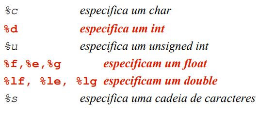

</center>

- Existe um operador na linguagem C responsável por indicar o endereço de memória de uma variável: '&'. Assim, se 'i' é uma variável então '&i' é o seu endereço. Será abordado a frente.
  
## Modificadores e especificadores
### Especificadores de tipo de classe de armazenamento
#### O que é?
São prefixos que podem ser usados na declaração de variáveis para definir a forma de armazenamento.

#### Para que serve?
Informar ao compilador a forma que ele deve armazenar a variável na memória.

#### Como funciona?
Os modificadores de tipos de acesso são:
```Markdown
> Extern
  - Variáveis declaradas com extern fazem referência a variáveis globais que serão usadas e são declaradas em outro arquivo.
  - Declaração: extern int x,y;
> Static
  - Quando usado em variáveis globais, informa ao compilador que a variável só poderá ser usada naquele arquivo. Outros arquivos não poderão reconhecê-la ou alterar seu conteúdo.
  - Quando usado em variáveis locais, as variáveis se tornam acessadas somente no bloco onde foram declaradas (Caso eu chame uma função no bloco que eu declarei essa variável local com static, ela poderá ser acessada pela função mesmo que não tenha sido declarada lá).
  - Declaração: static int x,y;
> Register
  - Para variáveis declaradas com register,é solicitado que o compilador salve a variável de forma que o acesso ao objeto seja o mais rápido possível. No caso de int e char, são armazenadas nos registradores da CPU ao invés de usar memória;
  - Variáveis nos registradores não possuem endereço de memória;
  - Objetos maiores como matrizes não são salvas nos registradores mas têm tratamento diferenciado. São ideais para controle de laços;
  - Declaração: register int temp;
```

Exemplo do uso de extern:

<center>

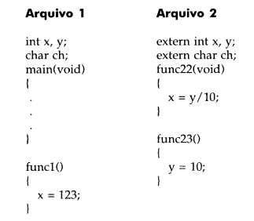
</center>

### Modificadores de tipos de acesso
#### O que é?
São prefixos que podem ser usados na declaração de variáveis para definir os tipos de acesso.

#### Para que serve?
Informar ao programa a forma que ele deve tratar o acesso à variável.

#### Como funciona?
Os modificadores de tipos de acesso são:
```Markdown
> Const
  - Variáveis declaradas com o const podem receber um valor inicial mas não podem ser modificadas pelo programa. Declaração:
  const int a=10;
> Volatile
  - Variáveis declaradas com volatile podem ter seus valores moficiados externamente ao programa. Por exemplo, uma variável que será passada para a rotina de um relógio, ela deve mudar automaticamente sem nenhum comando. Nesse caso volatile é uma boa opção. Declaração:
  
  volatile int a=10;
```
Exemplo curioso, uma variável pode ser const e volatile ao mesmo tempo? Sim.

Imagine uma variável que guarda o valor de uma porta (0x30) e é alterada somente por condições externas. Nesse caso uma boa opção é:
```
const volatile unsigned char *port = 0x30
```

# Operadores


## O que é?
São componentes lógicos e matemáticas das expressões.

## Para que serve?
Relacionar os dados e criar relações lógicas e matemáticas entre eles.

## Como funciona? 
Existem quantro classes de operadores e mais alguns operadores especiais.

**Observação:** Operadores unários são operadores que interagem apenas com um elemento (+, - , ++, --, por exemplo), binários são os que interagem sobre dois elementos (||, *, /, && por exemplo), Tenário são operadores interage com três elementos (?, por exemplo).

Exemplos:
- Unários:
  - a = -b;
  - a = +b;
- Binário
  - a = 5+3;
  - a = b+c;
- Ternário
  - var = a>b ? c : d;

1. **Operadores aritméticos**: Operações matemáticas.

- **'+' (adição)**
- **'−' (subtração ou menos unário)**
- **'∗' (multiplicação)**
- **'/' (divisão inteira. O resto é truncado)**
- **'%' (operador módulo da divisão - Resto)**
  - O operador módulo '%' não pode ser usado nos tipos em ponto flutuante.
- **'--' (Decremeto. Subtrai 1)**
- **'++' (Incremento. Soma 1)**
  - Incremento e decremento podem ser usado antes ou depois das variáveis.
```
x = 10;
y = ++x;

Ao final, x = 11 e y = 11. Já no próximo caso:

x = 10
y = x++

Ao final, x = 11 e y = 10.
```


2. **Operador de Atribuição**

- **'=' igual a**
  - Regra de conversão de tipos:
    - o tipo do "valor da expressão" (lado direito) é convertido no tipo do lado esquerdo
    - 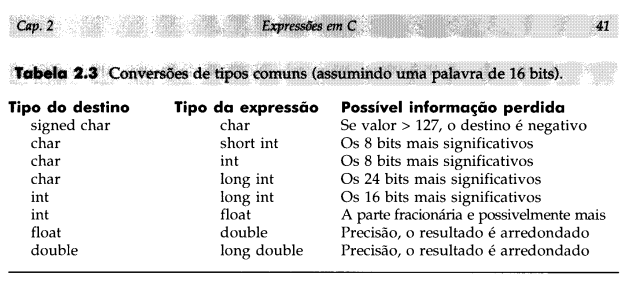
    - 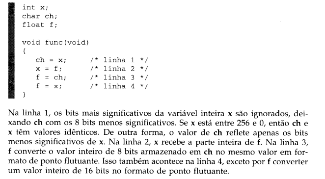

3. **Operadores relacionais**: Relação entre valores, sempre produz resultado 0 (falso) ou 1 (verdadeiro).

- **'==' igual**
- **'<>' ou '=!' diferente de**
- **'>' maior que**
- **'<' menor que**
- **'>=' maior ou igual a**
- **'<=' menor ou igual a**

4. **Operadores lógicos:** Maneira como as relações são conectadas e sempre produz resultado 0 (falso) ou 1 (verdadeiro)

 - **'||' ou**
 - **'&&' e**
 - **'!' não**


5. **Operadores bit a bit:** Testar, atribuir ou deslocar os bits efetivos em um byte ou em uma palavra. Só funciona para os tipos de dados *char* e *int* e suas variantes. Não entrarei a fundo nesses operadores.

- 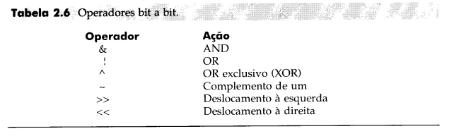

6. **Operadores especiais:**

- **'?' (Operador ternário)**
  - Forma geral: **Exp1 ? Exp2 : Exp3;**
  - Substitui if-then-else (comandos de controle do sistema). Testa a 'Exp1', se ela for verdadeira, então Exp2 é avaliada e se torna o valor da expressão. Se ela não for verdadeira, Exp3 se torna o valor da expressão.
  - O valor da Exp1 não precisa ser atribuido a nada e qualquer função que retorne um valor pode ser usada nas Exp2 e/ou Exp3.
    - 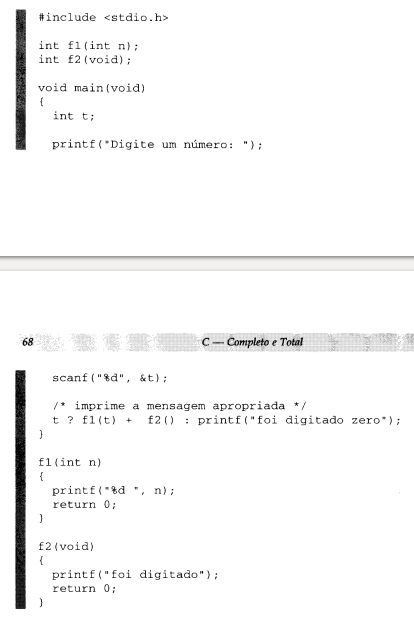


```
Exemplo:
x = 10;
y = x>9 ? 100:200;

Como a expressão 'x>9' é verdadeira, 'y' recebe 100.

Equivale a:

x = 10
if(x>9) y=100;
else y=200;

```

- **'& e \*' (Endereço na memória)**
  - '&' Operador unário que devolve endereço do seu operando. "Endereço de".
  - '*' é o complemento de '&'. Operador que devolve o valor localizado no endereço que segue. "No endereço de".
```
/*
* Testa operadores: * e &
*/
#include<stdio.h>

void main(void){
        int valor_de_m, m=10, *ponteiro;

        ponteiro = &m; /*A variável ponteiro recebe o endereço de m (&m)*/
        valor_de_m = *ponteiro; /*a variável 'valor_de_m' recebe o valor do ponteiro*/
        printf("valor_de_m: %d\n", valor_de_m);
        printf("m:%d\n", m);

}

```
- **'sizeof()'**
  - 'Operador' que retorna o tamanho em bytes da variável ou especificador de tipo.
```
float f;

printf("%f", sizeof f);
printf("%d", sizeof(int));
```
- **'() e {}'**
- **',' (Operador vírgula)**
  - Usado para encadear expressões: x = (y=3, y+1) Neste caso x = 4;
  - O lado mais a direito torna-se o valor de toda a expressão. "Faça isso e isso e isso.."
- **'+= e -=' (C reduzido)**
  - Variação do comando de atribuição e simplifica a codificação de um certo tipo de operação de atribuição.

```
 x = x + 10;

 é a mesma coisa que:

 x += 10;
```
- **'. e ->' (Operador Ponto e seta)**
  - Fazem referência a elementos individuais de estruturas e união (tipos de dados compostos).
  - Ponto é usado quando a referência se faz ao objeto real e a seta, quando é usado um ponteiro para a estrutura.


# Comandos de controle do programa
## O que é?
São chamadas do sistema.

## Para que serve?
Executar funções específicas.

## Como funciona?
Os comandos de controle podem ser dividios em algumas classes:

## Comandos de seleção
- **'if'**
  -  if (expressão) <comando (comando único ou bloco)>;
  else <comando (comando único ou bloco)>;
     - Variação dessa estrutura são os If's aninhados, escada if-else. São separados por níveis de identação e podem existir elementos 'else if (expressão)';  
     - As 'expressões' são testes condicionais (não necessariamente uma expressão. Pode ser qualquer chamada que retorne zero ou não) que determinam o curso da ação. Retornam um resultado verdadeiro (!=0) ou falso (0).
       -  Se for verdadeiro, o 'comando' do 'if' é executado. Se for falso, o comando do 'else' (se existir) é executado
       - 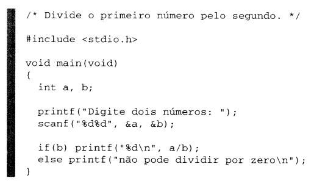
- **Switch**
  - 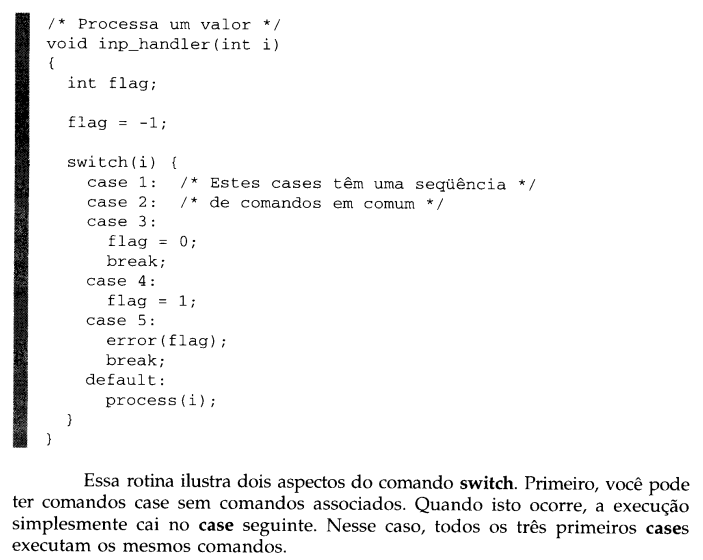
  - Testa sucessivamente o valor de uma expressão contra uma lista de constantes inteiras ou de characteres nos comandos 'case'. Caso, haja coincidência a sequência de comando é executada. Se nenhuma for encontrada, a sequência executada é a do default.
  - Se encerra quando a lista de coincidências se encerra ou quando o comando de desvio **break** é executado.
  - O switch só pode testar igualdades e constantes de caracteres usadas não automaticamente convertidas para seus valores inteiros


## Comandos de Iteração
- **While** 
- **For**
  - for(<inicialização>; <condição>; <incremento>)<comando>;
  - Condição de parada pré-definida. 
- **Do-While**
### **> Comandos de desvio**
- **Break**
- **Continue**
- **Return**
### **> Rótulos**
- **Case**
- **Default**


# Matrizes e vetores

## O que é?
É uma estrutura de dados. Considerando string como uma **sequência** de characteres: 
 - A matriz é um conjunto de 'strings' dispostas em linhas e colunas;
 - Os vetores são 'strings'.

## Para que serve?
Servem para resolver sistemas lineares de “n” equações e “n” incógnitas e, dessa forma, apresenta uma grande utilidade na engenharia, física, computação e afins. 

## Abordagens mais práticas
Declaração de vetores e matrizes em C:

```
int Vetor[5];  // declara um vetor de inteiros com 5 posições
int Matriz[5][3]; // declara uma matriz de inteiros com 5 linhas e 3 colunas
```

# Ponteiros
 Ponteiro: Endereço na memória de uma variável.
    - Variáveis que guardam ponteiros devem ser declaradas como ponteiros. Por exemplo, para declarar uma variável ponteiro ch do cipo char: char *ch;
    - *ch não é do tipo ponteiro é sim **tipo base do ponteiro**

A declaração do ponteiro é feita usando o '*'. Exemplo:
```
int *p; // Um ponteiro que apontará para um inteiro
int **p; // Um ponteiro que apotará para outro ponteiro que por sua vez, apontará para um inteiro. (Pontireo -> Ponteiro -> inteiro)
```


## O que é?
Um ponteiro é um tipo especial de **variável que armazena um endereço**.

## Para que serve?
Para referenciar endereços de memória.

## Como funciona?

Se um ponteiro '*p*' armazena o endereço de uma variável 'i', podemos dizer que:
-  '*p*' aponta para 'i'  
-  Ou, o endereço de 'i' é '*p*'

## Abordagens mais práticas

Em C, a declaração do ponteiro é feita usando o '*'. Exemplo:
```
int *p; // Um ponteiro que apontará para um inteiro
int **p; // Um ponteiro que apotará para outro ponteiro que por sua vez, apontará para um inteiro. (Ponteiro -> Ponteiro -> Inteiro)
```


A partir do exemplo a baixo, é fácil perceber que o vetor é uma espécie de "ponteiro" que guarda os elementos.
```
#include <stdio.h>

int main (void) 
{
    int v[3];
    printf("v=%p, &v=%p\n", v, &v);
    return 0; 
}
-------------------// Resultado //-------------------
v=0x7ffd224f722c
&v=0x7ffd224f722c
```

# Struct

## O que é?
É um tipo de variável especial. É uma variável que contém diversas outras variáveis normalmente de tipos diferentes

## Para que serve?
Basicamente, para simplificar o código e facilitar o entendimento.

## Como funciona?
Imagine que tenho uma struct *pessoa*. Ela é formada por outros dois tipos de dado, *idade* e *peso*. Além disso, temos uma variável *Gabriel* que é do tipo *pessoa*

```
struct pessoa{
  int idade;
  float peso;
}Gabriel;
```

# Recursividade
## O que é?
É um laço de repetição que relaciona a função consigo mesma.

## Para que serve?
Serve para resolver problemas que demandam esse tipo de operação. Por exemplo, fatorial.

## Como funciona?
Aproveitando do exemplo citado, a função passa para ela mesma um dado gerando um loop. Por exemplo:


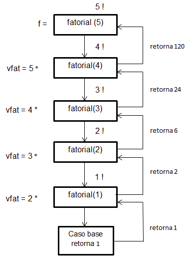


# Alocação de memória

Alocar memória, nada mais é do que separar um espaço na memória para alguma finalidade. Existem dois tipos de alocação de memória:
 - **Alocação estática**: Acontece antes que o programa comece a ser executado e não é variável.
 - **Alocação dinâmica**: Acontece de acordo com as necessidades de memória e pode ser dividida em:
    - **Explícita**: Você declara o espaço (Normalmente linguagens com typagem fraca);
    - **Implícita**: Não precisa declarar o espaço.

- **Heap**: Espaço de memória livre para armazenar ponteiros. Não segue uma ordem lógica fixa igual às pilhas.

## Alocação dinâmica de memória

Em C:
 - **malloc** : Função que aloca espaço para um bloco de bytes consecutivos na memória RAM.

 - **sizeof** : Operador que mostra quantos bytes o elemento tem

 - **free** : Função que apaga a variável que foi alocada dinamicamente. Quanto a variável não é local, elas desaparecem assim que a função termina.

```
typedef struct {
  int dia, mes, ano; 
} data;


int main()
{
    data *d; //Criando um ponteiro do tipo data
    d=malloc(sizeof (data)); //Alocando um espaço de memória para um espaço que cabe a estrutura 'data'
    d->dia = 31; d->mes = 12; d->ano = 2016; 
    printf("d.dia=%d\nd.mes=%d\nd.ano=%d\n&d->dia=%d\n&d->mes=%d\n&d->ano=%d", d->dia, d->mes, d->ano, &d->dia, &d->mes, &d->ano);
    return 0;
}
-------------------// Resultado //-------------------
d.dia=31
d.mes=12
d.ano=2016
&d->dia=24363024
&d->mes=24363028
&d->ano=24363032
```
