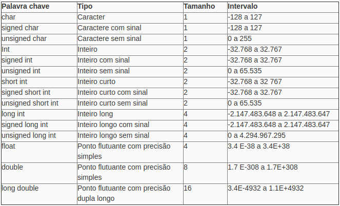

# **AEDS I**

### **O que é?**
É o estudo de algoritmos e estruturas de dados.

### **Pra que serve?**
O algoritmo serve para, a partir de uma entrada, termos uma saída.


### **Como funciona?**
De forma similar a uma receita que informa o que deve ser feito. Todavia, usa-se uma linguagem de programação. Algumas delas são:
- C;
- C++;
- Python;
- Java;
- Pascal;
- Fortran.

Todas elas tem seus paradigmas e regras específicas. E seguem a seguinte linha de raciocínio:

Código (Linguagens de programação) `->` Compilador ou Interpretador`->` Programa (Binário)

# **Paradigmas de Programação**

### **O que é?**
Segundo o [Wikpédia](https://pt.wikipedia.org/wiki/Paradigma_de_programa%C3%A7%C3%A3o), "Paradigma de programação é um meio de se classificar as linguagens de programação baseado em suas funcionalidades"
### **Pra que serve?**
Para que o programador tenha uma visão da estruturação e execução do programa

### **Como funciona?**
Existem vários paradigmas. Todavia, iremos abordar principalmente estes:
1. **Programação estruturada**
2. **Programação Orientada a Objetos**

Ambos têm a mesma função, resolver problemas. Porém, as formas de se analisar e simular o problema, são diferentes. Na Disciplina de **AEDS I**, focaremos na programação estruturada. Todavia, saiba que existem outros paradigmas.

# **Programação estruturada**

### **Como funciona?**
É uma programação baseada em laços de repetição, condicionais e estruturas em bloco (**Funções**). Formada por uma **sequência** de instruções e a comunicação entre os blocos se dá pela passagem de dados;


### **Abordagens práticas**
Usaremos como exemplo, a linguagem de programação C. Abaixo seguem alguns comandos.

#### **1.1 Operadores matemáticos**

 - '+' (adição) 
 - '−' (subtração ou menos unitário)
 - '∗' (multiplicação)
 - '/' (divisão inteira) 
 - '%' (resto – aplicado apenas aos valores inteiros).

#### **1.2 Operadores relacionais**

 - '=' igual a 
 - '<>' ou '=!' diferente de 
 - '>' maior que 
 - '<' menor que 
 - '>=' maior ou igual a 
 - '<=' menor ou igual a

#### **1.3 Operadores lógicos**

 - '||' ou
 - '&&' e
 - '!' não

#### **1.4 Chamadas de sistema**

 - **Print**("Imprimir na tela")
 - **Scanf** (Ler da tela)
 - **While** (Enquanto .. Loop de repetição)
 - **Switch / Case** (Condição de Escolha)
 - **For** (Para.. loop de repetição)
 - **If/else** (Expressão Condicional)


# **Tipos de dados**

### **O que é?**
Dados são números ou caracteres que usaremos no nosso código.

### **Pra que serve?**
Para representar algo do mundo real de forma computacional. Existem dois tipos básicos de dados:

- **Dados alfa-numéricos**: tratamento de textos e normalmente são compostos por uma seqüência de caracteres;
- **Dados numéricos**: Os inteiros + Reais.

Esstes tipos podem ser divididos em:
Os dados podem ser:
```Markdown
> Reais: Dados com informação dos conjuntos reais
  - Float : Ponto flutuante com precisão simples.
  - Double : Ponto flutuante com precisão menos simples do que o Float.

> Boleanos
  - 0 ou 1;

> Caracter (Char)
  - Caracteres, letras, símbolos.

> Void
  - Dados sem valor. Normalmente usado em funções

> String
  - "Vetor" de dados

> Inteiros
  - Dados com informações do conjunto dos inteiros.

```
### **Como funciona?**
Existem linguagem fortemente typadas e fracamente typadas. As fortemente typadas exigem que o tipo do dado seja fornecido, algo que não acontece nas fracamente typadas.

### **Abordagens mais práticas**
#### **1.1 Modificadores de dados**

São prefixos que alteram os tipos primitivos de dados. Alguns deles são:
``` Markdown
> Signed
  - É usado para 'Char'

> Unsigned
  - É usado para dados do tipo 'int'

> Long
  - Longo

> Short
  - Curto
```




### **1.2 Referenciando os dados**

Aqui, iremos apresentar formas de referenciar os dados de acordo com os seus tipos:
  


# **Variáveis / Memória**

### **O que é?**
São "apelidos" usados para auxiliar na resolução dos problemas

### **Pra que serve?**
Para representar dados dinâmicos

### **Como funciona?**
Tanto os dados quanto as variáveis de um programa ficam salvas na memória do computador. A memória é dividida em bytes e, cada byte tem seu endereço


### **Abordagens mais práticas** 
Existe um operador na linguagem C responsável por indicar o endereço de memória de uma variável: '&'. Assim, se 'i' é uma variável então '&i' é o seu endereço. Por exemplo:

```
int main()
{
    int j, k;
    *int *p;
    scanf("%d",&j);
    p=&j;
    printf ("j= %d \np=%d\n*p=%d\n&j=%d", j, p,*p,&j);
    return 0;
}
-------------------// Resultado //-------------------
50
j= 50
p=2091686828
p=50
&j=2091686828
```

Da mesma forma, existem uma função na linguagem C que mostra o número exato de bytes de uma variável e é dado por **sizeof**.

## **Alocação de memória**

Alocar memória, nada mais é do que separar um espaço na memória para alguma finalidade. Existem dois tipos de alocação de memória:
 - **Alocação estática**: Acontece antes que o programa comece a ser executado e não é variável.
 - **Alocação dinâmica**: Acontece de acordo com as necessidades de memória e pode ser dividida em:
    - **Explícita**: Você declara o espaço (Normalmente linguagens com typagem fraca);
    - **Implícita**: Não precisa declarar o espaço.

- **Heap**: Espaço de memória livre para armazenar ponteiros. Não segue uma ordem lógica fixa igual às pilhas.

### **1.1 Alocação dinâmica de memória**

Em C:
 - **malloc** : Função que aloca espaço para um bloco de bytes consecutivos na memória RAM.

 - **sizeof** : Operador que mostra quantos bytes o elemento tem

 - **free** : Função que apaga a variável que foi alocada dinamicamente. Quanto a variável não é local, elas desaparecem assim que a função termina.

```
typedef struct {
  int dia, mes, ano; 
} data;


int main()
{
    data *d; //Criando um ponteiro do tipo data
    d=malloc(sizeof (data)); //Alocando um espaço de memória para um espaço que cabe a estrutura 'data'
    d->dia = 31; d->mes = 12; d->ano = 2016; 
    printf("d.dia=%d\nd.mes=%d\nd.ano=%d\n&d->dia=%d\n&d->mes=%d\n&d->ano=%d", d->dia, d->mes, d->ano, &d->dia, &d->mes, &d->ano);
    return 0;
}
-------------------// Resultado //-------------------
d.dia=31
d.mes=12
d.ano=2016
&d->dia=24363024
&d->mes=24363028
&d->ano=24363032
```


# **Matrizes e vetores**

### **O que é?**
É uma estrutura de dados. Considerando string como uma **sequência** de caracteres: 
 - A matriz é um conjunto de 'strings' dispostas em linhas e colunas;
 - Os vetores são 'strings'.

### **Pra que serve?**
Servem para resolver sistemas lineares de “n” equações e “n” incógnitas e, dessa forma, apresenta uma grande utilidade na engenharia, física, computação e afins. 

### **Abordagens mais práticas**
Declaração de vetores e matrizes em C:

```
int Vetor[5];  // declara um vetor de inteiros com 5 posições
int Matriz[5][3]; // declara uma matriz de inteiros com 5 linhas e 3 colunas
```

# **Ponteiros**

A declaração do ponteiro é feita usando o '*'. Exemplo:
```
int *p; // Um ponteiro que apontará para um inteiro
int **p; // Um ponteiro que apotará para outro ponteiro que por sua vez, apontará para um inteiro. (Pontireo -> Ponteiro -> inteiro)
```


### **O que é?**
Um ponteiro é um tipo especial de **variável que armazena um endereço**.

### **Pra que serve?**
Para referenciar endereços de memória.

### **Como funciona?**

Se um ponteiro '*p*' armazena o endereço de uma variável 'i', podemos dizer que:
-  '*p*' aponta para 'i'  
-  Ou, o endereço de 'i' é '*p*'

### **Abordagens mais práticas**

Em C, a declaração do ponteiro é feita usando o '*'. Exemplo:
```
int *p; // Um ponteiro que apontará para um inteiro
int **p; // Um ponteiro que apotará para outro ponteiro que por sua vez, apontará para um inteiro. (Ponteiro -> Ponteiro -> Inteiro)
```


A partir do exemplo a baixo, é fácil perceber que o vetor é uma espécie de "ponteiro" que guarda os elementos.
```
#include <stdio.h>

int main (void) 
{
    int v[3];
    printf("v=%p, &v=%p\n", v, &v);
    return 0; 
}
-------------------// Resultado //-------------------
v=0x7ffd224f722c
&v=0x7ffd224f722c
```

# **Função**
### **O que é?**
É uma subrotina usada em um programa. Um bloco de ações

### **Para que serve?**
Para facilitar a estruturação e modularizar o código

### **Como funciona?**
Na programação estruturada, geralmente existe uma função **main** que é responsável por descrever um caminho principal e, nela, surgem chamadas para outras funções que executarão tarefas específicas. 

```
#inclusão dos arquivos de bibliotecas

declaração de variáveis globais

int main( )
{
        declaração de variáveis locais
        ...
        comandos;
        ...
}

tipo Nome_função(lista de argumentos)
{
        declaração das variáveis locais a função
        ...
        comandos;
        ...
}
```


# **Struct**

### **O que é?**
É um tipo de variável especial. É uma variável que contém diversas outras variáveis normalmente de tipos diferentes

### **Para que serve?**
Basicamente, para simplificar o código e facilitar o entendimento.

### **Como funciona?**
Imagine que tenho uma struct *pessoa*. Ela é formada por outros dois tipos de dado, *idade* e *peso*. Além disso, temos uma variável *Gabriel* que é do tipo *pessoa*

```
struct pessoa{
  int idade;
  float peso;
}Gabriel;
```

### **Abordagens Práticas?**


# **Recursividade**
### **O que é?**
É um laço de repetição que relaciona a função consigo mesma.

### **Para que serve?**
Serve para resolver problemas que demandam esse tipo de operação. Por exemplo, fatorial.

### **Como funciona?**
Aproveitando do exemplo citado, a função passa para ela mesma um dado gerando um loop. Por exemplo:


