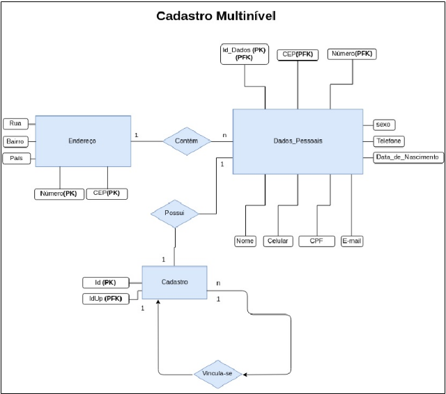
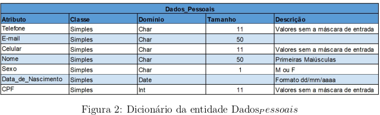
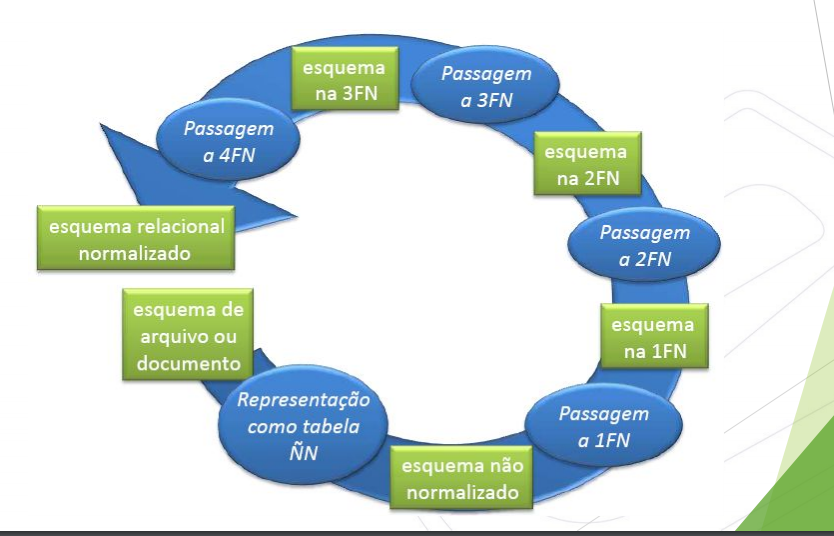

# Índice

- [Banco De Dados](#Banco-de-dados)
- [SGBD](#SGBD)
- [Modelos de Banco de Dados](#Modelos-de-banco)
  - [Conceitos para a Modelagem](##Conceitos-para-a-modelagem)
- [Modelagem Conceitual](#Modelagem-Conceitual)
  - [Regras de Cardinalidade](##Regras-de-Cardinalidade)
  - [Regras de Relação que contém atributo](##Regras-de-Relação-que-contém-Atributos)
  - [Conceitos de Entidade Relacionamento](##Conceitos-de-Entidade-Relacionamento)
  - [Restrição de Integridade](##Restrição-de-Integridade)
  - [Regra de mapeamento do modelo entidade relacionamento](##Regras-de-mapeamento-do-modelo-Entidade-Relacionamento)
- [Modelagem Lógica](#Modelagem-Lógica)
  - [Normalização](##Normalização-/-Engenharia-Reversa)
    - [Primeira forma normal](###Primeira-forma-normal)
    - [Segunda forma normal](###Segunda-forma-normal)
    - [Terceira forma normal](###Terceira-forma-normal)

# Banco de dados

## O que é?
É um conjunto de dados organizados/relacionados a fim de gerar sentido.
## Para que serve?
O objetivo do Banco de Dados é associar dados a fim de extrair informação , fazer **Abstração** dos dados.
## Como funciona?

Podemos dividir o banco de dados em níveis. Considerando as relações:


Os níveis são:


- **Nível Externo**: O que se vê.
- **Nível Lógico**: Descreve os dados armazenados e faz relação entre eles;
- **Nível Físico**: Descreve como os dados realmente estão armazenados.

# SGBD
## O que é?
Conjunto de dados + Conjunto de Programas que monitoram o banco = SGBD
## Para que serve?
SGBD é um software de propósito geral que facilita o acesso e manutenção do banco. O SGBD facilita:

- **Definição ou atividade**: Definição, estruturação do banco;
- **Construção**: Armazenar no disco;
- **Manipulação**: inserir, alterar, excluir, etc.

## Como funciona?

O SGBD funciona baseado em algumas características, são elas: 
- **Atomocidade dos dados**:\
  Indivisibilidade dos dados, só existe a conclusão da operação depois que a operação foi feita.

- **Controle sobre redundância**:\
  Evitar dados repetidos desnecessariamente;

- **Compartilhamento de Dados**:\
  Mais de uma pessoa pode ter acesso simultâneo;

- **Restrição de acesso não autorizado**:\
  Possui sistema de segurança garantido;
- **Fornecimento de múltiplas interfaces**;
- **Forçar restrições de integridade;**
- **Sistema de Backup e Recovery:** \
  As etapas são:
  1. Cópia dos dados;
  2. Checar a Integridade dos dados no destino;
  3. Teste de recovery.


## Abordagens Práticas

Algumas terminologias do SGBD:

- **Campo**: unidade básica de informação mínima, com significado;
- **Registro**: Conjunto de campos;
- **Arquivo**: Conjunto de registros;
- **Banco de dados**: Conjunto de arquivos e as formas de manipulação.
- **Tuplas** : Linha ou registro da tabela;

SGBD guarda metadados (Informações sobre outras informações [ Quem pode acessar, uma senha, as relações, onde vão ser guardados os dados, etc]). Também chamado de catálogo de dados


# Modelos de banco

## O que é?
São representações dos bancos de dados.
## Para que serve?
Servem para facilitar a construção/manipulação do banco
## Como funciona?
São divididos em:
- **Modelo conceitual**:
  - Alto nível;
  - Apresenta atributos;
  - Apresenta entidades;
  - Detalhamento de relacionamento (1 Verbo, normalmente).

- **Modelo lógico**:
  - Alto nível;
  - Apresenta os atributos;
  - Apresenta entidades;
  - Não existe detalhamento de relacionamento;
  - Existe a Cardinalidade;
  - Utiliza-se diagrama.

- **Modelo físico**
  - Baixo nível;
  - Usa uma linguagem;
  - Utiliza código de programação.


## Conceitos para a modelagem

- **Entidade**
  - Existe entidade **Concreta** e **Abstrata**;
  - É representada por retângulos.

- **Relacionamento**
  - Representado por Losango.
  - Tem graus e tipos:
    - Auto-Relavionamento ou Unaro:
      - Uma única entidade, que se relaciona consigo mesmo.
  
- **Atributo**:
Servem para detalhar o objeto, É representado através de linhas com bolinha na ponta ou circulos ao redor das palavras. São de vários tipos e o tipo é de acordo com o dado acumulado. Atributos podem ser:
    
  - **Simples**:
    - Uma única parte, não dividido (Nome, Matrícula).
    
  - **Compostos**:
    - Dividido em partes (Endereço);
  
  - **Monovalorado**:
    - Pode assunmir um único valor para uma entidade relacionamento.
  
  - **Multivalorado**:
    - Pode assumir mais de um valor para uma mesma entidade.
  
  - **Derivado**:
    - Vem como resultado de alguma operação.

Um atributo também pode ser chave:

  - **Chave Candidata**:
    - É o atributo que consegue identificar unicamente uma entidade (RG, CPF, Id Auto incrementável)

  - **Chave Primária**:
    - Chave candidata escolhida para se tornar a indentificável para a entidade. 
      > "Toda entidade precisa de uma chave primária"\
      > "Uma entidade só pode ter uma chave primária. Mas essachave primária pode ser formada por várias chaves candidatas"
    - Pode ser:
      - **Composta**: Várias Chaves em uma única chave primária;
      - **Simples**: Uma única Chave
  - **Chave Estrangeira**: 
    - Vai ser um atributo chave que vem de outra entidade.


# Modelagem Conceitual

## Como funciona?
É composto por:
- **Diagrama Entidade-Relacionamento**;
- **Atributos**;
- **Entidades**: 
  - **Entidade forte**:\
  ma tabela específica.

  - **Entidade fraca**:\
  Uma tabela com o atributo chave da entidade forte.
- **Chaves**;
- **Relação**;
- **Cardinalidade**:
  - Representa a conotação de ocorrência/fluxo. Pode ser:
    - **1:1** - **1** para **1**;
      - Uma entidade está associada a uma única entidade.
    - **1:n** - **Um** para **n**;
      - Uma entidade está associada a mais de uma entidade.
    - **n:n** - **n** para **n**.
      - Uma entidade está associada a n entidades e a outra entidade se relaciona n vezes com a primeira.

Exemplo:

$$Cliente --(1,n)-- Possui --(n,1)-- Conta$$

Ou seja: **1** cliente pode possuir **n** contas, e **1** conta pode ter **n** clientes. Ou, pode virar (n,n)

$$Cliente --(n)-- Possui --(n)-- Conta$$


Outro Exemplo:

$$Aluno --(1,1)-- Possui --(1,1)-- Matrícula$$

Ou seja: **1** aluno possui **1** matrícula, e **1** matrícula só pode ser de **1** aluno


## Regras de Cardinalidade

- Toda vez que a cardinalidade for de **muitos** para **muitos** (**n:n**) entre duas entidades, surge delas uma nova entidade. Essa nova entidade vai receber a chave primária das outras entidades. Se transformando em chaves estrageiras.
- Quando a cardinalidade for **1** (Entidade forte) para **n** (Entidade Fraca), a entidade com cardinalidade **1** tem sua chave primária passada para a outra entidade como chave estrangeira.
- Quando a cardinalidade for **1** para **1**, temos a "liberdade" de escolher em qual lado vai ficar a chave estrangeira

## Regras de Relação que contém Atributos
Caso uma relação contenha um atributo:
- Se as entidades estiverem a relação **1** para **1** o atributo vai para qualquer uma das entidades;
- Se as entidades estiverem a relação **n** para **n**, o atributo vai para a nova tabela criada;

## Conceitos de Entidade Relacionamento

- **Agregação**:\
  Junção de várias entidades em uma única tabela;\
  Entidade associativa.

- **Especialização**:\
  Consiste na identificação de subgrupos de entidades;

- **Generalização**:\
  Enfatizar a semelhança entre os tipos de entidades;


- **Domínio**:\
  Aquilo que caracteriza o atributo, representa o tipo do atributo;
    - **Exemplo**: O atributo nome, o tipo dele é varchar(30) [Definição do Domínio].

- **Relação**:\
  É a mesma coisa que as entidades ou tabelas de um banco.

## Restrição de Integridade
São regras para manter os dados íntegros, aumentando a segurança. Podem ser de 4 tipos:
- **Restrições de chaves**:\
  Deve assumir um valor único em todas as tuplas da relação.
    
  - **Restrição de Integridade de Entidade**:\
   Uma chave primária não pode ser nula em qualquer tupla da relação;

  - **Restrição de Ingridade Referencial**:\
  Uma tupla em uma relação que se refere a outra relação, deve se referenciar a uma tupla enxistente nessa relação (Chave estrangeira).

  - **Restrição de Integridade Semântica**:\
  Define o tipo específico de informação aceita no atributo (Não pode ser qualquer dado)
    - **Exemplo**: sexo - Masculino ou feminino. 

- **Restrição de Participação**:\
  A existência de uma entidade depende de sua participação e um tipo de relacionamento
    - **Participação total**:\
      Dentro do sistema, toda a entidade vai ter que estar vinculada a outra. Sem parcialidade
      - **Exemplo**: Empregado --Trabalha--Departamento

    - **Participação Parcial**:\
      Dentro do sistema, nem toda a entidade estará vinculada a outra.
      - **Exemplo**:Empregado --Gerencia--Departamento

- **Restrição de integridade Semântica**:\
Como por exemplo, nível de formação, Cargo, Sexo. São restrições que não se encaixam nas primeiras apresentadas.

Existe mais uma restrição que será abordada mais a frente, a **Restrições de Integridade referencial**.



## Regras de mapeamento do modelo Entidade Relacionamento

1. Todas as entidades são mapeadas para uma relação;
   
2. Para relacionamento 1:1, inclua a chave primária da entidade forte como chave estrangeira na **entidade que estiver participação total** na relação.
  
3. Para relacionamento 1:N, inclua a chave primária da entidade forte como chave estrangeira na **entidade 1** da relação.
  
4. Para relacionamento N:M, Cria-se uma nova relação contendo as chaves primárias das outras entidades.


# Modelagem Lógica

## Como funciona?
Composta por:
- Tabelas;
- Domínio de dados (Tipo dos dados)

## Abordagens Práticas
Exemplos:


## Normalização / Engenharia Reversa

### O que é?
É também chamada de Engenharia reversa porque a normalização parte dos dados brutos para criar uma relação. Consiste no uso de filtros para tornar a base de dados a mais simples e eficiente.

### Para que serve?
Objetivo da normalização: Transformar dados brutos em dados tratados (Lipidação dos dados)

### Como funciona?
A normalização consegue seu objetivo
- Eliminando anomalias;
- Eliminando redundância;

Basenado-se nas etapas de normalização:




- Tabela com dados brutos;
  - Tabela não-primeira-forma-normal;
  - Notação ÑN;

### Primeira forma normal

- Não devem existir tabelas aninhadas;
- Não devem existir atributos multivalorados ou compostos.

O que é tabela aninhada? Tabelas onde:
- Existem coluna que, ao invés de conter valores atômicos, contém tabelas (uma coluna dentro de outra tabela);
- Grupo repetido
- Coluna não-atômica


### Segunda forma normal

Além de estar na primeira forma normal, os **dados não deverão ter uma dependência funcional parcial**

Dependência funcional é a relação entre atributos onde com um, eu consigo achar o outro. (Espécie de função bijetora)

Existem cinco tipos de dependência funcional. Mas as mais importantes para o banco de dados são: 

- **Dependência Funcional Parcial**:\
  A tabela deve ter uma chave primária composta e algum atributo depende de apenas uma das partes da chave primária.

- **Dependência Funcional de Transitividade**:\
  Se eu tiver A eu consigo achar B, Se eu tiver B eu consigo obter C. Logo, se eu tiver A eu posso ter C.


### Terceira forma normal

Deve estar na segunda e não poderá ter dependência funcional transitiva


# **Álgebra Relacional**
Existem alguns operadores que se aplicam a duas relações que obedeçam a **compatibilidade de união**.

    Ambas possuem atributos que pertencem aos mesmo domínios

- **União ( $\cup$ )**:\
  Todas as tuplas que pertencem a um e a outro conjuntos.

- **Intersessão ( $\cap$ )**:\
  Todas as tuplas que pertencem, simultaneamente aos dois conjuntos.

- **Diferença ( - )**:\
  As tuplas que aparecem em um dos conjuntos e não aparecem no outro. A-B: Tuplas que aparecem em A e não aparecem em B

Operadores relacionais:

- **select**:\
  Resulta em tuplas contendo os mesmos atributos da relação que satisfazem uma determinada condição de seleção
```
select[< Condição de Seleção >](< Nome da relação> )
```
- Pode-se usar os conectivos:
  - E (^);
  - OU (V).

- E os operadores:

  - <>;
  - =;
  - <;
  - \>;
  - <=;
  - \>=.

- **project**:\
  Seleciona atributos de uma relação de acordo com uma listra de atributos
```
project< Lista de atributos>(< Relações>)
```

- **join**:\
  Combina tuplas relacionadas de duas relações em uma tupla simples.
```
join[< Condição >](< Nome da tabela1>, < Nome da tabela2>)
```


# **SQL**

### O que é?
É a linguagem padrão universal para manipular bancos de dados relacionais através dos SGBDs.
### Para que serve?
Manipular o banco de dados
### Como funciona?
Segue:
- Estilo Declarativo, não procedimental;
- Dividida em algumas classes:
	- DDL (Linguagem de definição de dados) 
	- DML (Linguagem de manipulação de dados)
	- DCL (Dícionários de dados - Metadados)

## **DDL**
Usada para definir a base de dados

### **Create**
- Cria uma definição

### **Alter**
- Altera alguma definição

### **Drop**
- Exclui alguma definição

### **Table**
- Define uma tabela, seus campos e as trstrições

### **Index**
- Define o índice associado a um capo de uma tabela

### **Grant**
- Definição de segurança, tipo de permissão

### **Exception**
- Define uma mensagem de erro

### **Database (CREATE e DROP)**
- Define uma base de dados.


  - **CREATE DATABASE**: cria uma base de dados

        CREATE TABLE < nome da tabela>(
        	< Definição de coluna 1> < Tipo de dados> <restrições de integridade>
        	< Definição de coluna N> < Tipo de dados> <restrições de integridade>
        	< restrições de integridade>
        );


  - < Definição de coluna> pode ser:
  	- < nome atributo>
  - < tipos de dados> pode ser:
  	- {SMALLINT | INTEGER | FLOAT | DOUBLE PRECISION}
	  -|{DECIMAL|NUMERIC}[(precision[,scale])]
	
      Exemplo: Decimal($\underbrace{8}_{\textrm{Total de caracteres}},\underbrace{4}_{Total de casas decimais}$)
	
  	- DATE
	  -|{CHAR|CHARACTER|CHARACTER VARYING|VARCHAR}
	  -[(int)]
	  -|BLOB

  - < restrições de integridade> pode ser:
  	- PRIMARY KEY
  	- NOT NULL
    - UNIQUE
  	- DEFAULT
  	- CHECK
    - FOREIGN KEY

## **DML**
### **Insert**
- Insere uma tupla, múltiplas tuplas a partir de uma tabela;

### **COMMIT**
- Grava os comandos que foram executados;

### **Rolback**
- Desfaz todas as ações realizadas até encontrar o último commit que ele executou 

### **UPDATE**
- Altera os dados

### **DELETE**
- 

### **SELECT**

Variações:
  - DISTINCT


- **Restrições de Integridade referencial**

  - **NO ACTION**: Não permite alteração ou exclusão se houver dependência
  - **SET DEFAULT**: Se houver um valor default para a coluna da chave estrangeira, ela recebe este valor
  - **CASCADE**: Propaga a exclusão
  - **SET NULL**: atribui o valor nulo