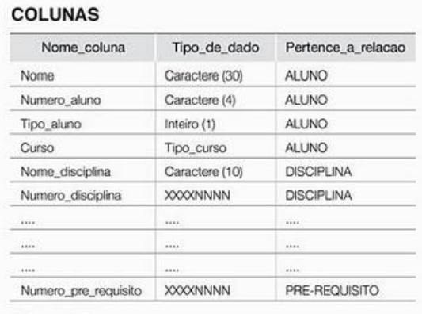
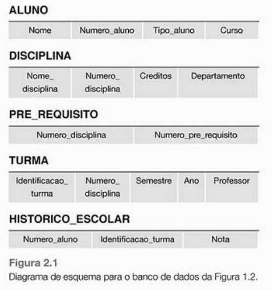
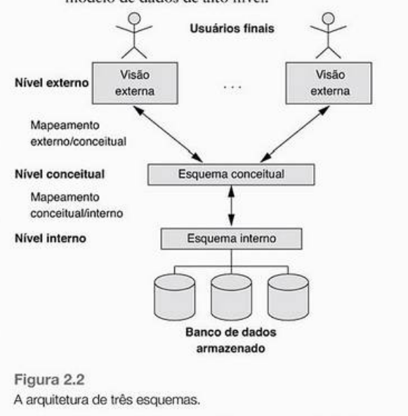

conversar um pouquinho sobre banco de dados _______ Porque deveriam assistir essa aula?

Perguntas que façam a pessoa pensar

Hoje nós vamos tentar responder uma pergunta

Porque banco de dados é importante?

-------
Vamos iniciar o vídeo pensando em duas perguntas. 
a primeira é essa :
Slide 1 (Lê)
A segunda é essa :
Slide 2 (Lê)

Para tentar responder, eu vou começar contando uma história. história de supermercado por exemplo

O que são dados?
 - Dados são fatos conhecidos que podem ser registrados e possuem significados implícitos

Obs.: Dado [Carro] != Informação (Tem elementos básicos, ela tem implicito ideias associadas, não é o dado bruto)

O que é um banco de dados? 
 - " Conjunto de dados interrelacionados a fim de gerar sentido"
 - coleção lógica e coerente de dados com algum significado
 - Tem interação e represente algum aspecto do mundo real ou seja as mudanças no mundo real, interferem nos dados e as mudanças devem ser refletidas no banco a fim de torná-lo preciso e confiável.

Obs.: Banco de dados é projetado, definido, populado com uma função específica

O que é um SGBD?
SGBD -> Aplicação
"informação é poder"

No exemplo da receita federal por exemplo: Os dados precisam ser organizados e gerenciados para que os usuários possam consultar, recuperar e atualizar os dados

O banco de dados pode ser gerado e mantido manualmente ou pode ser computadorizado

SGBD -> Coleção de programas que ajudam o usuário a criar e manter um banco de dados ele facilita o processo de definição, construção, manipulação e compartilhamento de bancos de dados entre usuários 

O que é um catálogo de banco de dados?

A definição e a informação descritiva do banco de dados também é armazenada na forma de um catálogo ou dicionário chamado METADADOS:
	- Estrutura dos dados;
	- Estrutura dos arquivos;
	- O tipo dos dados;

Mas, por qeu isso?
	- Pense que um SGBD precisa servir tanto à uma Universidade, quanto para um banco. Se não houvesse metadados a generalização para quaisquer aplicações, seria inviável ou impossível.
Geralmente as definições expostas aqui são representadas por projetistas antes da criação do banco de dados real

Exemplo da Universidades imagens:  exuniversidade

O que é o processamento de arquivos tradicional?
	- Uso de papeis para guardar documentos
	- "Cada usuário define e implementa os arquivos necessários para uma aplicação de software específica como parte da programação da aplicação."

Exemplo: Departamento de registros acadêmicos  > eles tem o programa para imprimir o histórico e mantem arquivos sobre os alunos e suas notas.
Departamento de finanças > registram as mensalidades e seus pagamentos

Embora ambos estejam interessados em dados sobre os alunos cada um matém arquivos separados.

- Atualização precisa ser feita em dois locais diferentes

Diferença Banco de Dados Processamento de arquivos tradicional:
	- Banco de dados um único repositório mantém dados, definidos uma única vez, e vários usuários acessam.
	- No processamento de arquivo tradicional qualquer alteração na estrutura de arquivos em uma aplicação, pode exigir alteração em todos os programas que acessem o arquivo
	- No processamento de arquivo tradicional a estrutura do arquivo de dados está embutida na aplicação, cada grupo de usuários mantém os seus próprios arquivos para tratamento de suas aplicações (Cada grupo mantém de maneira independente os arquivos sobre os alunos exemplo departamento financeiro e departamento de registros de uma universidade)

Benefícios de se usar um SGBD:
	- Isolamento entre programas e dados
	- Controle de redundância
		- Menos esforço, menos memória para armazenamento;
	- Restrição de acesso :  pois, nem sempre, todos podem ver, atualizar e consultar todos os dados
	- Consultas e atualizações mais rápidas e eficientes: índices, buffer e caching (pois os dados precisam ser relacionados no disco e também precisam ser copiados continuamente para a memória principal RAM durante uma consulta por exeplo);
	- Backup e recuperação;
	- Relacionamento de dados complexos;
	- Restrições de integridade:
		- Tipo de dado de cada item;
		- Restrição de integridade referencial;
		- Restrição de chave ou Singularidade (Uso de valores exclusivos -- Chaves primárias)
	- Regras de dedução: Inserção de regras na aplicação do minimundo no Sistema Gerenciador do Banco de Dados dedutivo através de:
		- Uso de Gatilhos ou triggers para ativar as regras definidas --- por meio de atualização de tabela
		- procedimentos armazenados ou stored procedures
		- Sistemas de bancos de dados ativos

Quando não usar um SGBD?
	- Alto Custo (Alto investimento em hadware e Software);
	- Sistemas embarcados com capacidade de armazenamento limitada;
	- Requisitos rigorosos de tempo real (Por causa das operações extras executadas pelo SGBD)

----- Por que muitas ferramentas de projetos assistido por computadores (CAD) possuem software proprietário para gerenciamento de arquivos e dados?

SGBD multiusuário:
	- Possui um software de controle de concorrência (chamdas de aplicações de processamento de transação online OLPT) a fim de garantir autenticidade dos dados. Propriedades:
		- Isolamento dos dados (Transações isoladas, apesar de simultâneas);
		- atomicidade (Todas as operações em uma transação serão executadas)
---- Exemplo de várias pessoas tentando comprar uma mesma cadeira em um avião (Operações concorrentes)

Transação é um programa em execução que inclui um ou mais acessos ao banco de dados

Atores:
1. Administradores de banco de dados:
	- Autorizar acessos ao banco;
	- Coordenar e monitorar o uso.
	- Problemas como falha na segurança e demora no tempo de resposta do sistema.

2. Projetistas do banco de dados:
	- Identificar os dados e escolher estruturas apropriadas para o armazenamento
	- Entender necessidades dos usuários;

3. Usuário final:
	- Consultam o banco de dados;
	- Atualizam o banco de dados;
	- Geram os relatórios;

4. Analistas de sistemas e programadores:
	- Definem as especificações das transações para atender os usuários finais

normalização de dados:
	- Cada item de dados lógicos são armazenados em um único lugar no banco. Porém em alguns casos, compensa usar a redundância controlada para melhorar o desempenho das consultas

Exemplo histórico escolar. Armazenar nome do aluno e horas redundantemente no arquivo histórico escolar

[imagem redundanciacontrolada.png]

Conceitos e arquiteturas do SGBD
- Arquitetura cliente\servidor:
	- Modular:
    	- Cliente: executa em um computador pessoal, interação com o usuário final
    	- Servidor: armazenamento de dados, acesso, pesquisa e outras funções

- Sistema de banco de dados oferece abstração de dados (como local de armazenamento, querys de consulta)

## Modelos de dados
- Conceitos usados para descrever a estrutura de um banco de dados
	- tipo de dados, restrições e relacionamentos;
	- Contém operações básicas que podem ser aplicadas ao banco:
    	- inserir, excluir, modificar e recuperar;
    	- calcula_media (um exemplo para um objeto aluno); 

- Existem três tipos de classes para os modelos
1. Modelos de dados de Alto Nível ou conceituais: Oferecem conceitos que descrevem detalhes de como os dados são armazenados no computador
   1. Entidades:  Um objeto ou conceito do mundo real descrito no banco de dados
   2. Atributos: Propriedade de interesse que descreve melhor a entidade
   3. Relacionamento: Associação entre entidades
2. Modelos de dados representativos: Modelos de dados baseados em registros
   1. Modelos de dados relacionais
   2. Modelos de rede e hierárquicos
   3. Modelos de dados de objeto
3. Modelos de dados de Baixo Nível ou físicos: descrevem o armazenamento dos dados como arquivos no computador
   1. Formatos de registros
   2. Ordenações de registros
   3. Caminhos de acesso: Estrutura que torna eficiente a busca Exemplo índice

Banco de dados

Qual a diferença entre um banco de dados relacional e um banco de dados não relacional?

Fonte 1: https://blog.totalcross.com/pt/banco-de-dados-relacional-nao-relacional/

	Banco de dados relacional:
		Dados guardados em forma de tabela
		Aqui a estrutura do banco de dados deve ser projetada, caso os esquemas das tabelas não estejam definidos, não será possível inserir dados nelas.

	Não Relacional:
		não se tem a necessidade de fazer todo o esquema antes de começar a utilizá-lo,até porque todas as informações serão agrupadas em um registro,

Fonte 2: https://pt.stackoverflow.com/questions/191919/banco-de-dados-n%C3%A3o-relacionais-vs-banco-de-dados-relacionais

	Banco de dados relacional:
		É baseada em esquema
		linguagem SQL serve exclusivamente para acesso aos dados 

	Não Relacional:
		Não é baseada em esquema
		NoSQL: Not Only Structured Query Language

http://db4beginners.com/blog/postgresql-como-um-banco-de-dados-nosql/

O tipo JSON armazena uma cópia exata do texto de entrada, cujas funções de processamento devem ser reexaminadas em cada execução; enquanto tipo JSONB armazena os dados em um formato binário decomposto que o torna um pouco mais lento para a entrada devido à sobrecarga da conversão, mas significativamente mais rápido para processar, já que não é necessária qualquer reparação.

Por ser binário, não significa que ele vai ocupar menos espeço, significa que ele vai ser mais fácil de processar (Binário é possível indexar)

CRUD vem do inglês Create Read Update e Delete que em tradução livre para o português seria Criar, Ler, Atualizar, e Excluir. O CRUD é composto pelas operações básicas que uma aplicação faz a um banco de dados.

# Exercício
- Conceitue
  - Esquemas?
  - Instancias?
  - Diagrama de Esquema?
  - Esquema?
  - Instância?
  - Construtor do esquema?