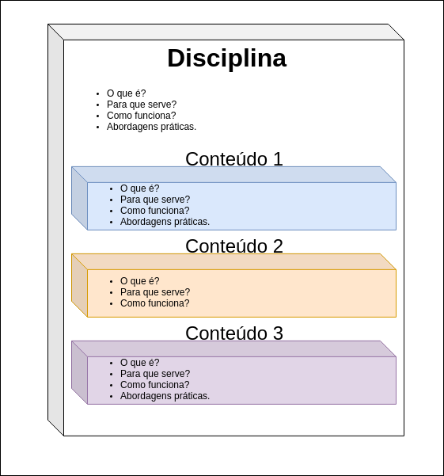

# caes

Projeto do C.A.E.S para organização interna das demandas.

# Padrão de Projeto

Os resumos das disciplinas serão organizados em módulos e os módulos serão compostos por:
- **Introdução**:
  - O que é?
- **Finalidade**:
  - Para que serve?
- **Funcionalidade**:
  - Como funciona?
- **Abordagens práticas** 
  - Opcional

